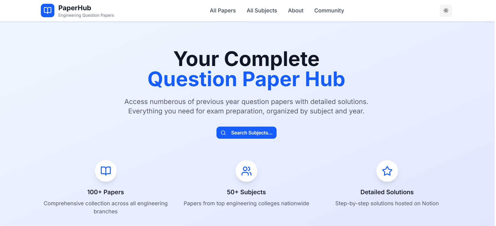
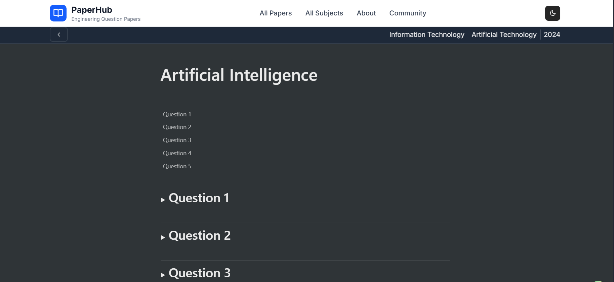
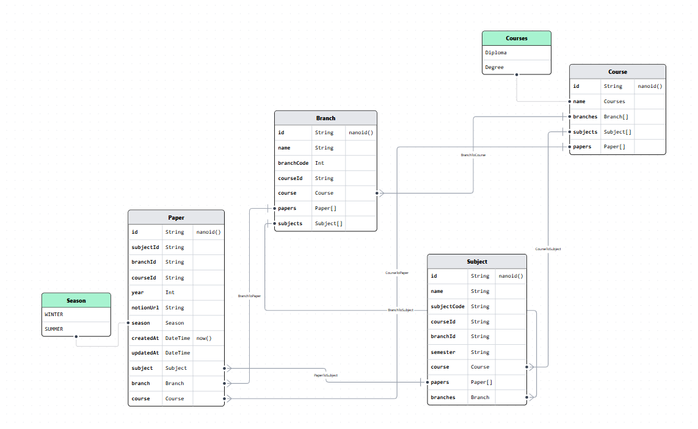

# 📚 Engineering Question Paper Repository

A full-stack web application built with **Next.js**, **Hono**, **Prisma**, **ShadCN UI**, **TanStack Query**, and **Zod**, designed to help engineering students browse, upload, and manage semester-wise question papers efficiently.

## 🧠 Features

- 📂 Browse papers by course, branch, subject, season, and year.
- 📥 Upload and edit papers via an admin panel.
- 🔒 Protected admin routes with token-based authentication (no user DB needed).
- 🔍 Smart subject search (supports abbreviations like "OS" for "Operating System").
- 🧠 Notion integration for solution previews.

## 🚀 Live Demo

Coming soon...

---

## 🖼️ Screenshots

### 🏠 Home Page





### 📄 Solution Page





---

## 🗂️ Folder Structure

```text
📦src
├── 📁app
│   ├── 📁(header)
│   ├── 📁(nonHeader)
│   ├── 📁api
│   ├── 📄layout.tsx
│   ├── 📄page.tsx
│   ├── 📄not-found.tsx
├── 📁components
├── 📁features
│   ├── 📁admin         # Admin panel logic (forms, modals, table columns)
│   ├── 📁auth          # Admin auth logic, session, and middleware
│   ├── 📁hooks         # Custom shared hooks
│   └── 📁notion        # Notion integration for rendering solutions
├── 📁lib               # Utility functions and database
├── 📄globals.css
├── 📄.env
```

---

## 🧪 Tech Stack

- **Frontend:** Next.js 14 App Router, Tailwind CSS, ShadCN UI, React Hook Form, Zod, Tanstack Query
- **Backend:** Hono (Edge server), Prisma ORM, JWT-based session middleware
- **DB:** PostgreSQL (via Prisma)
- **Notion:** For solution storage and rendering using `notion-renderer`

---

## 🔐 Admin Login

- No database-based users.
- Admin email/password stored in `.env` file.
- Session expires after **2 hours**.

```env
ADMIN_EMAIL=youradmin@example.com
ADMIN_PASSWORD=yourStrongPassword
SESSION_SECRET=yourJWTSecret
```

---

## 🛠 How to Run Locally

```bash
# 1. Clone the repo
git clone https://github.com/yourusername/engg-paper-repo
cd engg-paper-repo

# 2. Install dependencies
npm install

# 3. Setup environment variables
cp .env.example .env
# Fill in DATABASE_URL ADMIN_EMAIL, ADMIN_PASSWORD, SESSION_SECRET

# 4. Run database setup
npx prisma generate
npx prisma db push

# 5. Start dev server
npm run dev
```

> Visit: http://localhost:3000

---

## 🤝 How to Contribute

We welcome contributions! Here's how to get started:

1. Fork the repository.
2. Create a new branch:
   ```bash
   git checkout -b feature/your-feature-name
   ```
3. Make your changes and commit:
   ```bash
   git commit -m "Add: New feature"
   ```
4. Push to your fork and create a pull request.

Please follow best practices for folder structure and keep PRs focused.

---

## 🧠 Prisma ER Diagram


📌 Prisma Schema Diagram:




---

## 📃 License

This project is licensed under the MIT License.